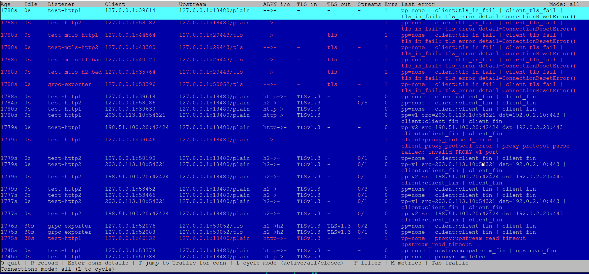
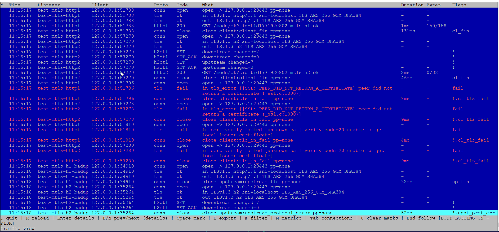

# wiretracer

TLS-terminating diagnostic L7 proxy for HTTP/1.1, HTTP/2, and gRPC.

## Screenshots


## Table of Contents
- [Key Features](#key-features)
- [Quick Start](#quick-start)
- [Typical Use Cases](#typical-use-cases)
- [gRPC Notes](#grpc-notes)
- [Test Suite](#test-suite)
- [Documentation](#documentation)
- [License](#license)

## Key Features
- Protocol visibility: `http1`, `http2`, `grpc`.
- TLS/mTLS diagnostics on both sides (`client->proxy`, `proxy->upstream`).
- HTTP/2 control-plane telemetry (`SETTINGS`, `RST_STREAM`, `GOAWAY`, flow-control) when `logging.h2_control_events: true`.
- HTTP/2 fingerprinting (`h2fp`) from early control-plane behavior (`SETTINGS` + connection-level `WINDOW_UPDATE`).
- Inbound TLS ClientHello fingerprinting: `JA3`, `JA4`, `ECH` detection, and legacy `ESNI` marker (best-effort).
- TUI mode and headless JSONL mode.
- TUI diagnostics improvements:
  - error/warn row highlighting in Traffic and Connections views;
  - `Errs` column in Connections view (per-connection error counter).
- PROXY protocol support:
  - inbound auto-detection (`none`, `v1`, `v2`, malformed);
  - forwarding to upstream using the same detected PROXY version;
  - extra metadata in logs/UI: `proxy_version`, `proxy_src`, `proxy_dst`.

## Quick Start
```bash
python3 wiretracer.py --gen-config > config.yaml
python3 wiretracer.py --config config.yaml --check
python3 wiretracer.py --config config.yaml
```

Headless mode:
```bash
python3 wiretracer.py --config config.yaml --headless
```

## Typical Use Cases
- `grpcurl` fails with `EOF`, `Unavailable`, `deadline exceeded`.
- Upstream negotiation issues (`no_application_protocol`, wrong ALPN).
- mTLS trust chain/cert verification errors.
- Understanding whether failures happen at TLS, H2 control, or RPC level.
- Preserving original client endpoint through PROXY protocol.

## gRPC Notes
`event.duration_ms` is request/RPC latency, while `conn.duration_ms` is full TCP/TLS connection lifetime.
For h2 keep-alive clients (for example `grpcurl`/grpc-go), a connection can stay open for ~30s after a successful RPC. This is expected.

## Test Suite
- Main guide: `test-suite/TEST_SUITE_GUIDE_RUS.md`
- Test components:
  - `test-suite/fault_client.py`
  - `test-suite/fault_server.py`
  - `test-suite/verify_headless.py`
  - `test-suite/run_proxy_test_suite.sh`

## Documentation
- Full Russian user guide: `UserGuide-rus.md`
- Russian short README: `README-rus.md`
- Test kit docs:
  - `test-suite/Readme-eng.md`
  - `test-suite/Readme-rus.md`
  - `test-suite/TEST_SUITE_GUIDE_RUS.md`
- Extra historical guide: `ug-qwen.md`

## License
Use according to your repository license policy.


