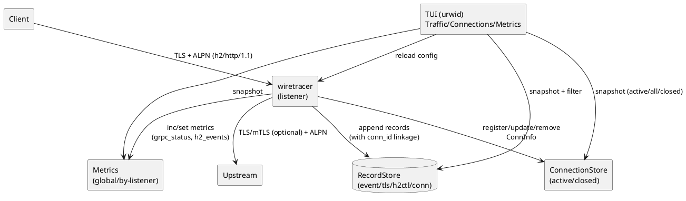

# Обновленная документация: wiretracer v1.29.0

## 1. Назначение и сценарии применения

`wiretracer` — инструмент для глубокой диагностики сетевых и протокольных проблем, когда «непонятно, что реально уходит/приходит», особенно при:

- **TLS/mTLS**: ошибки в SNI/ALPN/CA/цепочке сертификатов/верификации
- **HTTP/2 + gRPC**: клиенты получают `EOF`, `Unavailable`, `context deadline exceeded`, а истинная причина — `GOAWAY`/`RST_STREAM`/`SETTINGS`/flow-control
- **Проксирование «в разрыв» (MITM)**: наблюдение и логирование запросов/ответов + управляющих событий

**Ключевая особенность**: в общем списке **Traffic** показываются не только запросы, но и:
- события жизненного цикла соединения (`conn`)
- события TLS-handshake (`tls`)
- управляющие события HTTP/2 (`h2ctl`)
- запросы/ответы (`event`)

Это позволяет быстро ответить на вопрос «почему соединение закрылось» вместо «что произошло».

---

## 2. Как работает «в двух словах»

Прокси слушает порт `listen` и терминирует входящий TLS (может требовать клиентский сертификат — входящий mTLS).

Далее по **ALPN**:
- если клиент выбрал `h2` → прокси поднимает HTTP/2 сервер на входе и HTTP/2 клиент на выходе (upstream), т.е. **h2 ↔ h2**, проксируя stream'ы
- если `http/1.1` → полноценное проксирование HTTP/1.1 с парсингом заголовков и тел (не просто raw tunnel)
- иначе — включает **raw tunnel** (просто перекачка байт в обе стороны)

На выходе прокси может:
- идти в upstream по TLS (и проверять сертификат/имя)
- предъявлять клиентский сертификат (исходящий mTLS)

Прокси сохраняет в **Store** записи **4 типов**:
- `event` — запрос/ответ (http2/grpc/http1)
- `tls` — событие рукопожатия TLS (ok/fail + причина + категория + детали)
- `h2ctl` — управляющие события HTTP/2 (SETTINGS/GOAWAY/RST/WINDOW_UPDATE/FLOW_BLOCK)
- `conn` — события жизненного цикла соединения (wait/open/close)

Все записи автоматически связываются через поле `conn_id` для сквозной диагностики.

---

## 3. Установка и зависимости

### 3.1 Требования
- Python 3.10+ (рекомендуется 3.11+)
- Библиотеки:
  - `urwid` — TUI
  - `pyyaml` — конфигурация
  - `h2` (hyper-h2) — HTTP/2 стек

### 3.2 Установка
```bash
python3 -m venv venv
source venv/bin/activate
pip install urwid pyyaml h2
```

---

## 4. Быстрый старт

### 4.1 Сгенерировать пример конфига
```bash
./wiretracer.py --dump-example-config > config.yaml
```

### 4.2 Проверить конфиг
```bash
./wiretracer.py --check --config config.yaml
```

### 4.3 Запуск в TUI (по умолчанию)
```bash
./wiretracer.py --config config.yaml
```

### 4.4 Headless режим (без UI)
```bash
./wiretracer.py --headless --config config.yaml
```

---

## 5. Конфигурация YAML: все параметры

### 5.1 Структура
```yaml
listeners:
  - name: ...
    listen: "0.0.0.0:9100"
    tls: { ... }          # входящий TLS + входящий mTLS
    upstream: { ... }     # выходящий TLS + исходящий mTLS
    policy: { ... }       # политики безопасности и таймауты
    logging: { ... }      # логирование и захват тел
```

### 5.2 Входящий TLS (`tls:`)
| Поле | Тип | Значение |
|------|-----|----------|
| `cert` | string | Путь к сертификату сервера (proxy) |
| `key` | string | Путь к ключу сервера |
| `require_client_cert` | bool | Требовать клиентский сертификат (mTLS inbound) |
| `client_ca` | string/null | CA-файл для проверки клиентских сертификатов |
| `alpn` | list | Обычно `["h2", "http/1.1"]` |
| `min_version` | string | `TLS1.2` или `TLS1.3` |

> **Важно**: если `require_client_cert: true`, то `client_ca` должен быть задан, иначе старт упадёт.

### 5.3 Upstream (`upstream:`)
| Поле | Тип | Значение |
|------|-----|----------|
| `addr` | string | `host:port` upstream |
| `tls` | bool | Использовать TLS до upstream |
| `server_name` | string/null | SNI и hostname-check (если `verify=true`) |
| `verify` | bool | Проверять сертификат upstream |
| `ca` | string/null | CA для upstream (если `verify=true` и нестандартная CA) |
| `alpn` | list | Для gRPC почти всегда `["h2"]` |
| `client_cert` | string/null | Клиентский сертификат для исходящего mTLS |
| `client_key` | string/null | Ключ |
| `client_key_password` | string/null | Пароль ключа (если есть) |

### 5.4 Policy (`policy:`) — **НОВОЕ**
| Поле | Тип | Значение по умолчанию | Описание |
|------|-----|----------------------|----------|
| `allowlist` | list | `[]` | Список разрешённых CIDR; пустой = все разрешены |
| `max_connections` | int | `200` | Лимит одновременных подключений к listener |
| `upstream_connect_timeout` | float | `5.0` | Таймаут TCP-соединения с апстримом (сек) |
| `upstream_handshake_timeout` | float | `10.0` | Таймаут TLS handshake с апстримом (сек) |
| `read_timeout` | float | `30.0` | Таймаут ожидания данных при активной фазе (сек) |
| `idle_timeout` | float | `120.0` | Общий таймаут простоя соединения (сек) |
| `maxconn_wait_warn_ms` | float | `200.0` | Порог для логирования задержек из-за лимита соединений (мс) |

### 5.5 Logging (`logging:`)
| Поле | Тип | Значение по умолчанию | Описание |
|------|-----|----------------------|----------|
| `log_headers` | bool | `true` | Логировать заголовки |
| `log_body` | bool | `false` | Логировать тела запросов/ответов |
| `body_max_bytes` | int | `0` | Лимит захвата тела: `0` = без лимита (но есть hard-cap 10MB), `8192` = 8KB |
| `redact_headers` | list | `["authorization", "cookie", "x-api-key"]` | Какие заголовки замазывать |
| `sample_rate` | float | `1.0` | Доля записей для логирования (1.0 = все) |
| `h2_control_events` | bool | `false` | Включать `h2ctl` записи (`SETTINGS/ACK`, `WINDOW_UPDATE`, `RST_STREAM`, `GOAWAY`, `FLOW_BLOCK`) |
| `jsonl_path` | string/null | `null` | Путь к файлу JSONL для записи всех событий |

> **Важно**: `body_max_bytes` ограничивает только **захват для отображения**, не проксирование. Прокси всегда проксирует полный поток.

---

## 6. TUI: режимы и горячие клавиши

### 6.1 Два основных представления
| Представление | Описание | Переключение |
|---------------|----------|--------------|
| **Traffic** | Хронологический список всех событий (запросы + контрольные события) | `Tab` / `C` |
| **Connections** | Активные/закрытые соединения «прямо сейчас» с диагностикой | `Tab` / `C` |

### 6.2 Режимы представления **Connections** — **НОВОЕ**
В представлении **Connections** три режима (переключение по **L**):

| Режим | Описание | Когда использовать |
|-------|----------|-------------------|
| `active` | Только активные соединения | Мониторинг текущей нагрузки |
| `all` | Активные + недавно закрытые | Диагностика проблем с короткоживущими соединениями |
| `closed` | Только закрытые соединения | Анализ причин разрывов |

Столбцы в представлении:
- **Age** — возраст соединения в секундах
- **Idle** — время простоя в секундах
- Для закрытых соединений `Idle` фиксируется на момент закрытия (не растёт дальше)
- **Streams** — для HTTP/2: `открытые/всего` стримов
- **Errs** — количество ошибок на соединение (инкрементируется при `set_error` и проблемном закрытии)
- **Last error** — последняя ошибка соединения с классификацией (`client_rst`, `upstream_fin`, `timeout` и т.д.)

Цветовая индикация:
- в **Traffic** error/warn строки выделяются цветом (в т.ч. `h2ctl GOAWAY/RST_STREAM/FLOW_BLOCK`);
- в **Connections** проблемные соединения подсвечиваются как error.

### 6.3 Горячие клавиши (общие)
| Клавиша | Действие |
|---------|----------|
| `Q` | Выход |
| `R` | Перезагрузка конфигурации (очищает историю) |
| `Tab` / `C` | Переключение между Traffic и Connections |
| `M` | Показать метрики |
| `F` | Открыть диалог фильтрации |
| `H` / `F1` | Помощь |
| `Esc` | Закрыть оверлей/диалог |

### 6.4 Горячие клавиши (Traffic)
| Клавиша | Действие |
|---------|----------|
| `Enter` | Показать детали выбранной записи |
| `Space` | Пометить/снять пометку (mark) |
| `Shift+C` | Очистить все пометки |
| `E` | Экспорт: помеченные записи или текущая строка |
| `End` / `G` | «Follow tail» (держать фокус на последних записях) |
| `Up/Down/PageUp/PageDown` | Навигация (отключает follow tail) |
| `K` | **НОВОЕ**: перейти к соединению текущей записи в представлении Connections (режим `all`) |

### 6.5 Горячие клавиши (Connections)
| Клавиша | Действие |
|---------|----------|
| `Enter` | Показать детали соединения |
| `T` | **НОВОЕ**: применить фильтр `conn=<id>` в Traffic для просмотра всех событий этого соединения |
| `L` | Циклическое переключение режимов: `active` → `all` → `closed` |

### 6.6 Горячие клавиши (в режиме Details)
| Клавиша | Действие |
|---------|----------|
| `P` / `N` | Предыдущая/следующая запись (с учётом текущего фильтра) |
| `Esc` | Закрыть детали |

---

## 7. Типы строк в Traffic и как их читать

### 7.1 `proto=conn` — события жизненного цикла соединения (**НОВОЕ**)

| Событие | Описание | Когда появляется |
|---------|----------|------------------|
| `wait` | Задержка принятия соединения из-за лимита `max_connections` | `wait 125ms` — клиент ждал 125мс |
| `open` | Соединение принято | `open -> 127.0.0.1:50052` |
| `close` | Соединение закрыто | `close proxy:client_idle_timeout 1250ms` |

**Практическая ценность**: мгновенно видно, почему соединение закрылось — таймаут клиента, сброс апстрима, протокольная ошибка и т.д.

Пример записи `conn close`:
```
conn  close  close proxy:client_idle_timeout  1250ms  client_idle_timeout
```

### 7.2 `proto=tls` — события TLS handshake (**РАСШИРЕНО**)

Показывает:
- `side=in` — клиент → proxy
- `side=out` — proxy → upstream
- `outcome=ok/fail`
- `reason` при fail: `unknown_ca`, `handshake_failure`, `no_application_protocol`, `cert_verify_failed`, ...

**НОВОЕ**: для ошибок верификации сертификатов добавлены поля:
- `category`: классификация ошибки (`expired`, `wrong_eku`, `unknown_ca`, `signature_failure`)
- `detail`: детальное сообщение об ошибке

Пример в интерфейсе:
```
tls  fail  in cert_verify_failed [unknown_ca | unable to get local issuer certificate] TLSv1.3 TLS_AES_256_GCM_SHA384
```

**Почему это важно**: раньше все ошибки верификации сертификатов выглядели одинаково. Теперь можно мгновенно отличить:
- просроченный сертификат (`expired`)
- проблему с назначением сертификата (`wrong_eku`)
- отсутствие цепочки доверия (`unknown_ca`)
- ошибку подписи (`signature_failure`)

### 7.3 `proto=h2ctl` — управляющие события HTTP/2
Это ключевой must-have для gRPC диагностики (если включено `logging.h2_control_events: true`):
- `SETTINGS` / `SETTINGS_ACK` — настройки сторон (окна, фреймы)
- `WINDOW_UPDATE` — изменения окна flow-control
- `FLOW_BLOCK` — ситуации «окно ушло в 0» / «хочу отправить N байт, но нельзя»
- `RST_STREAM` — резкий сброс стрима
- `GOAWAY` — graceful shutdown соединения с кодом и отладочными данными

Классический симптом: `grpcurl` получает `EOF`/`Unavailable`, а в Traffic видно `RST_STREAM` или `GOAWAY` с причиной.

### 7.4 `proto=grpc` / `proto=http2` / `proto=http1` — события запросов/ответов
В деталях:
- заголовки request/response
- время (Start/End)
- stream_id (для HTTP/2)
- захваченное тело (ограничено `body_max_bytes`)

Для gRPC тело показано как:
- структура gRPC frames (5 байт заголовок + payload)
- hexdump+ascii
- «strings» (вытащенные печатаемые последовательности)

---

## 8. Фильтрация (**РАСШИРЕНО**)

Фильтрация применяется к обоим представлениям (Traffic и Connections). Синтаксис:

| Синтаксис | Пример | Описание |
|-----------|--------|----------|
| `=` | `proto=grpc` | Точное совпадение |
| `^=` | `client^=192.168.` | Префикс |
| `~` | `path~^/helloworld\.Greeter/` | Регулярное выражение |
| `in (...)` | `proto in (http*,grpc)` | Сопоставление с шаблонами (`*` = префикс) |
| `conn=<uuid>` | `conn=550e8400-e29b-41d4-a716-446655440000` | **НОВОЕ**: фильтр по конкретному соединению |
| `error=1` | `error=1` | Только записи с ошибками |
| `category=...` | `category=unknown_ca` | **НОВОЕ**: фильтр по категории TLS ошибок |
| `side=...` | `side=out` | **НОВОЕ**: только исходящие TLS события |

**Практические примеры**:
```bash
# Все события конкретного соединения (получить conn_id из Traffic или Connections)
conn=550e8400-e29b-41d4-a716-446655440000

# Все ошибки верификации сертификатов с категорией unknown_ca
proto=tls outcome=fail category=unknown_ca

# gRPC вызовы с ошибками от конкретного клиента
proto=grpc error=1 client=10.0.0.

# HTTP/2 control события от апстрима
proto=h2ctl direction=upstream
```

---

## 9. Метрики (**НОВОЕ**)

Система метрик с разбивкой по листенерам. Показывается по клавише **M**.

### 9.1 Глобальные метрики
```
GLOBAL:
  connections_accepted: 42
  connections_denied: 3
  maxconn_wait: 5
  h2_streams_opened: 156
  h2_streams_reset_in: 2
  h2_streams_reset_out: 1
  h2_goaway_in: 3
  h2_goaway_out: 1
  h2_flow_block: 7
```

### 9.2 Метрики по листенеру
```
grpc-mitm:
  connections_accepted: 42
  tls_out_ok: 42
  tls_out_fail: 0
  h2_streams_opened: 156
  grpc_status_0: 142    # OK
  grpc_status_14: 8     # UNAVAILABLE
```

### 9.3 Ключевые метрики
| Метрика | Описание |
|---------|----------|
| `grpc_status_<N>` | Счетчики по кодам gRPC статусов (0=OK, 14=UNAVAILABLE и т.д.) |
| `h2_flow_block` | Блокировки из-за flow control (окно = 0) |
| `h2_streams_reset_in/out` | Сбросы стримов клиентом/апстримом |
| `h2_goaway_in/out` | GOAWAY от клиента/апстрима |
| `tls_out_ok/fail` | Статистика исходящих TLS соединений |
| `maxconn_wait` | Количество задержек из-за лимита соединений |

---

## 10. Архитектурные диаграммы (PlantUML)

### 10.1 Расширенная архитектура компонентов (**ОБНОВЛЕНО**)



### 10.2 Диагностика жизненного цикла соединения (**НОВОЕ**)

```plantuml
@startuml
actor Client
participant Proxy
participant Upstream
database Store
database ConnStore

Client -> Proxy : TCP connect
Proxy -> ConnStore : add(ConnInfo)\nstate=opened
Proxy -> Store : conn(open)

alt max_connections reached
  Proxy -> Store : conn(wait)\nreason="125ms"
  Proxy -> ConnStore : set_error("maxconn_wait:125ms")
end

Proxy -> Proxy : TLS handshake (in)
alt ok
  Proxy -> Store : tls(in, ok)\n+ conn_id linkage
  Proxy -> ConnStore : set_tls_in(...)
else fail
  Proxy -> Store : tls(in, fail)\ncategory=..., detail=...
  Proxy -> Store : conn(close)\nreason=tls_in_fail
  Proxy -> ConnStore : remove(...)\nclose_reason=tls_in_fail
  stop
end

Proxy -> Upstream : connect + TLS (out)
alt ok
  Proxy -> Store : tls(out, ok)
  Proxy -> ConnStore : set_upstream(...)
else fail
  Proxy -> Store : tls(out, fail)
  Proxy -> Store : conn(close)\nreason=upstream_connect_fail
  Proxy -> ConnStore : remove(...)\nclose_reason=upstream_connect_fail
  stop
end

loop request/response cycles
  Proxy -> Store : event(proto=grpc/http2/http1)
end

alt graceful close
  Proxy -> Store : conn(close)\nreason=completed\nduration=1250ms
else timeout/error
  Proxy -> Store : conn(close)\nreason=client_idle_timeout\nclosed_by=proxy
end

Proxy -> ConnStore : remove(...)\nclose_reason=..., closed_by=...
@enduml
```

### 10.3 Watchdog и таймауты (**НОВОЕ**)

```plantuml
@startuml
title HTTP/2 watchdog: обнаружение зависаний

participant Proxy
database ConnStore
note over Proxy
Watchdog проверяет каждые 250мс:
- время с последней активности апстрима
- общее время простоя соединения
end

loop каждые 250мс
  Proxy -> Proxy : last_upstream_io_ts?
  alt (now - last_upstream_io_ts) > read_timeout
    Proxy -> ConnStore : set_error("upstream_read_timeout")
    Proxy -> Proxy : close sockets\nmark upstream_read_timeout
  else (now - last_any_io_ts) > idle_timeout
    Proxy -> ConnStore : set_error("proxy_idle_timeout")
    Proxy -> Proxy : close sockets\nmark proxy_idle_timeout
  end
end

@enduml
```

---

## 11. Практические сценарии диагностики

### Сценарий 1: «Соединения обрываются через 30 секунд»

1. В **Connections** видим `close_reason=client_idle_timeout`
2. Проверяем текущие таймауты: `idle_timeout` в конфиге
3. Решение: увеличить `policy.idle_timeout` в конфигурации

### Сценарий 2: «gRPC вызовы падают с UNAVAILABLE»

1. Фильтр в Traffic: `proto=grpc error=1`
2. Смотрим связанные записи того же `conn_id` (клавиша **K**):
   - `tls out fail category=unknown_ca` → проблема с цепочкой сертификатов
   - `h2ctl GOAWAY code=ENHANCE_YOUR_CALM` → рейт-лимит на апстриме
   - `h2ctl FLOW_BLOCK` → проблемы с flow control
3. Проверяем метрики: `grpc_status_14` — сколько таких ошибок

### Сценарий 3: «Клиенты не могут подключиться из-за сертификата»

1. Фильтр: `tls in fail`
2. В колонке **What** сразу видим категорию:
   - `[expired | certificate has expired]` → сертификат просрочен
   - `[wrong_eku | unsuitable certificate purpose]` → неправильное назначение сертификата
   - `[unknown_ca | unable to get local issuer certificate]` → отсутствует цепочка доверия
3. Фильтруем по категории: `category=expired` — все просроченные сертификаты

### Сценарий 4: «Короткоживущие соединения не видны в Connections»

1. Переключаемся в режим **all** (клавиша **L** до `all`)
2. Ищем соединение по `client_ip` или `upstream_addr`
3. Нажимаем **T** для перехода к событиям этого соединения в Traffic

---

## 12. Примеры конфигурации

### 12.1 Базовый шаблон с таймаутами (**ОБНОВЛЕНО**)

```yaml
listeners:
  - name: grpc-mitm
    listen: "0.0.0.0:9100"
    tls:
      cert: "/opt/certs/proxy.crt"
      key: "/opt/certs/proxy.key"
      require_client_cert: false
      client_ca: null
      alpn: ["h2", "http/1.1"]
      min_version: "TLS1.2"
    upstream:
      addr: "127.0.0.1:50052"
      tls: true
      alpn: ["h2"]
      server_name: "localhost"
      verify: false
      ca: null
      client_cert: null
      client_key: null
    policy:
      allowlist: ["10.0.0.0/8", "192.168.0.0/16"]
      max_connections: 200
      upstream_connect_timeout: 5.0
      upstream_handshake_timeout: 10.0
      read_timeout: 30.0
      idle_timeout: 120.0
      maxconn_wait_warn_ms: 200.0
    logging:
      log_headers: true
      log_body: true
      body_max_bytes: 8192
      redact_headers: ["authorization", "cookie", "x-api-key"]
      sample_rate: 1.0
      jsonl_path: "/var/log/packet-monitor/proxy.jsonl"
```

### 12.2 HTTP/1.1 проксирование с логированием тел

```yaml
listeners:
  - name: http1-proxy
    listen: "0.0.0.0:8080"
    tls:
      cert: "/opt/certs/proxy.crt"
      key: "/opt/certs/proxy.key"
      require_client_cert: false
      client_ca: null
      alpn: ["http/1.1"]  # только HTTP/1.1
      min_version: "TLS1.2"
    upstream:
      addr: "127.0.0.1:8000"
      tls: false  # plain HTTP к апстриму
      alpn: []
    policy:
      allowlist: ["0.0.0.0/0"]
      max_connections: 500
      read_timeout: 30.0
      idle_timeout: 60.0
    logging:
      log_headers: true
      log_body: true
      body_max_bytes: 65536  # 64KB
      redact_headers: ["authorization", "cookie"]
      jsonl_path: "/var/log/packet-monitor/http1.jsonl"
```

---

## 13. Вставка прокси «в разрыв» при занятом порте (iptables)

Очень типичный кейс: порт занят самим сервисом, но нельзя его перенести.

### Базовая идея
1. Входящие подключения на `:26379` перенаправить на порт прокси (например `:16379`)
2. Прокси слушает `:16379`, а upstream у него `127.0.0.1:26379`
3. Клиенты по-прежнему стучатся в `:26379` и ничего не знают

### Пример для локального сервиса
```bash
# Прокси слушает 16379, сервис остаётся на 26379
iptables -t nat -A PREROUTING -p tcp --dport 26379 -j REDIRECT --to-ports 16379

# Для локальных клиентов (с той же машины)
iptables -t nat -A OUTPUT -p tcp -o lo --dport 26379 -j REDIRECT --to-ports 16379
```

### Проверка и откат
```bash
# Показать правила
iptables -t nat -L PREROUTING -n -v --line-numbers

# Удалить правило по номеру строки
iptables -t nat -D PREROUTING <N>
```

---

## 14. Карта типовых ошибок gRPC и что искать в Traffic

### 14.1 Быстрый чек-лист при `EOF`/`Unavailable`/`deadline exceeded`

1. Найди в Traffic `tls(in)` событие рядом по времени
   - Если `tls in fail` → проблема на входе (клиент→proxy): CA, mTLS, ALPN, версия TLS
2. Найди `tls(out)` событие
   - Если `tls out fail` → проблема на выходе (proxy→upstream): verify/SNI/CA/mTLS
3. Если оба TLS ok и включен `logging.h2_control_events: true` — проверь наличие `h2ctl SETTINGS`
   - Если нет SETTINGS → HTTP/2 не стартовал (проблема с ALPN)
4. Потом смотри `h2ctl GOAWAY` / `RST_STREAM` / `FLOW_BLOCK` вокруг момента ошибки

### 14.2 Таблица: grpc-status → причины → что искать

| grpc-status | Причина | Что искать в Traffic |
|-------------|---------|----------------------|
| **0 (OK)**, но клиент ругается | Проблема на транспортном уровне | `h2ctl GOAWAY` сразу после ответа, `RST_STREAM` на другом стриме |
| **2 (UNKNOWN)** | Исключение на сервере | `h2ctl RST_STREAM` (INTERNAL_ERROR), `GOAWAY` с debug data |
| **3 (INVALID_ARGUMENT)** | Неверный запрос / параметры | В деталях: тело запроса (strings/hexdump) |
| **7 (PERMISSION_DENIED)** | Отказ авторизации/ACL | В деталях: `grpc-message`, request metadata |
| **13 (INTERNAL)** | Ошибка приложения | `grpc-message`, `RST_STREAM`/`GOAWAY` |
| **14 (UNAVAILABLE)** | Сеть/балансировщик/апстрим недоступен | `tls out fail`, `GOAWAY` (ENHANCE_YOUR_CALM), `RST_STREAM`, `FLOW_BLOCK` |
| **16 (UNAUTHENTICATED)** | Неправильные креды/токен | `grpc-message` ("missing auth token") |
| **Отсутствует**, клиент получает `EOF` | Соединение порвано до trailers | `h2ctl RST_STREAM`, `GOAWAY`, `tls` ошибки |

---

## 15. Рекомендации по эксплуатации

### Для gRPC/OTLP
- На входе: `tls.alpn: ["h2","http/1.1"]` (curl и другие любят предлагать оба)
- На выходе: `upstream.alpn: ["h2"]` (чтобы избежать случайного downgrade)
- Для первичной диагностики: временно `upstream.verify: false`, затем включить и настроить `ca`

### Для больших тел
- Держите `body_max_bytes` в пределах 8–64KB для комфортной работы UI
- Включайте `jsonl_path` для сохранения полной истории

### Для диагностики зависаний
- Установите разумные `read_timeout` (30с) и `idle_timeout` (120с)
- При зависании соединения в логах появится `upstream_read_timeout` или `proxy_idle_timeout`
- Watchdog автоматически закроет зависшие соединения

### Для короткоживущих соединений
- Используйте режим **Connections → all** (клавиша **L**)
- Фильтруйте по `conn=<id>` для просмотра полной истории соединения

---

## 16. Версия и обратная связь

**Версия инструмента**: 1.29.0  
**Автор**: Тарасов Дмитрий  
**Ключевое улучшение**: переход от «что произошло» к «почему произошло» за счёт:
- связанных записей через `conn_id`
- расширенной классификации ошибок TLS
- метрик по статусам gRPC и HTTP/2 событиям
- режимов диагностики соединений (`active`/`all`/`closed`)
- watchdog для автоматического обнаружения зависаний


